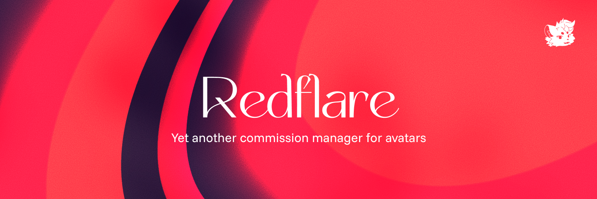

# 🌠 Redflare
This web app is focused to avatar artists, a replacement for kanban-board apps like Trello and Notion. Redflare is a commission organizer web app that includes dashboard for artists and customers, billing and attachment organization.

## 🤔 Why Redflare?
Many note-taking applications charges to the final user for general usage, those apps are customizable for artists but with a lot of options that doesn't follow a proper standard, giving to the artist the freedom but at the same time the decision of what "format/style" to use when organizing their commissions. This is why I made Redflare, to create a standard to organize stuff for avatar artists, you can find it as a "template" for artists if you want, with billing features and storage management.

## ⭐ Features & planned ideas
- Management for billing and asset storage (`.unitypackage`, `.spp`, etc.).
- Audit logs for artists.
- Role management with Auth0: **Artist** and **Manager**.
- Separated sessions for artists (Agent User) and customers (Public User).
- Simple and practical user interface for artists and customers.
  - UI isn't customizable in-app.

## 📚 Deployment and stack required
Redflare uses many services to work:

- **MongoDB** database (MongoDB Atlas cloud solution works fine).
- **Auth0 tenant** for artist authentication.
- **Discord OAuth App** for customer authentication
- **Any S3-compatible storage** to store files like `.unitypackage`, `.spp`, etc.

0. Make sure you already have the following installed in your system:
    - [bun](https://bun.sh/)
    - [docker](https://www.docker.com/) and [docker-compose](https://docs.docker.com/compose/install/) for local development.
    - If you are using Windows, I strongly recommend to use **WSL** for the local environment.
1. Clone and `cd` into the project root folder.
2. Make sure to copy the `.env.example` file, paste and rename it to `.env`. You'll have to fill every field to make the app work properly. **For E2E testing**, same step but for `.env.test.example`.
3. Setup the following services, don't forget to fill `.env` with your API keys!
    - Set up the database for the app, a MongoDB Atlas cloud instance should work.
    - Set up the Auth0 tenant for the artist authentication.
    - Create a Discord developer app for the customer authentication.
    - Set up an S3-compatible storage for the file storage. I recommend using **Cloudflare R2** for this.
4. Install the dependencies with `bun i`.
5. Deploy the local development with `bun dev`.

```bash
git clone https://github.com/xaeky/redflare.git
cd redflare
cp .env.example .env
vim .env # Fill the fields with your API keys.
bun i
bun dev
```

## 🧪 Testing
To run tests we use Playwright (it may ask you to install it or install a headless browser), you need to have a `.env.test` file with the proper configuration. You can use `.env.test.example` as reference.

Then, run the tests with:
```bash
bun test # --ui for GUI window.
```
# 📜 License
GPL-3.0 © 2026 [Xaeky](https://ko-fi.com/xaeky)
